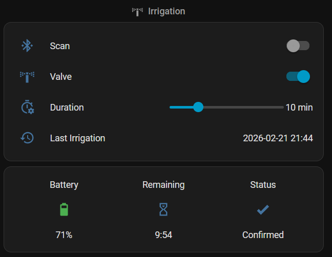

# Galcon BT Irrigation Controller for Home Assistant

A custom Home Assistant integration for the **Galcon 9001BT** Bluetooth irrigation controller.

## Features

- **Open / Close valve** from the HA dashboard
- **Configurable irrigation duration** — default set during setup, adjustable via dashboard slider (1–120 min)
- **Battery level** sensor (read from device)
- **Time remaining** countdown with live 1-second ticks
- **Operation status** sensor (Idle, Connecting, Opening, Closing, Confirmed, Error)
- **Auto-discovery** of Galcon devices via BLE scan (filters by `GL9001A` device name)
- **Timed irrigation** service (`galcon_bt.open_valve_timed`)

## Installation

1. Copy `custom_components/galcon_bt` from this repo into your HA `config/custom_components/` directory.
2. Restart Home Assistant.
3. Go to **Settings → Devices & Services → Add Integration** → search **Galcon BT**.
4. Select your device from the BLE scan list, or enter the MAC address manually.

## Scanning & Battery Life

The Galcon 9001BT is battery-powered. To conserve battery, **BLE scanning is off by default** — no periodic connections are made.

| Mode | Behavior |
|------|----------|
| **Scanning OFF** | Valve open/close commands still work. Battery and status show cached values. |
| **Scanning ON** | Polls the device every 5 minutes for live status, countdown, and battery. |

Turn scanning on when you need live feedback, off when you don't.

## Entities

| Entity | Type | Description |
|--------|------|-------------|
| `switch.<name>_scanning` | Switch | Toggle BLE scanning on/off |
| `valve.<name>_valve` | Valve | Open/close the irrigation valve |
| `number.<name>_duration` | Number | Irrigation duration slider (1–120 min) |
| `sensor.<name>_battery` | Sensor | Battery level (%) — cached |
| `sensor.<name>_time_remaining` | Sensor | Irrigation countdown (MM:SS) |
| `sensor.<name>_status` | Sensor | Current operation phase |

## Dashboard Card

```yaml
type: vertical-stack
cards:
  - type: entities
    title: Irrigation
    show_header_toggle: false
    entities:
      - entity: switch.galcon_irrigation_scanning
        name: Scan
        icon: mdi:bluetooth-connect
      - entity: valve.galcon_irrigation_valve
        name: Valve
        icon: mdi:sprinkler-variant
      - entity: number.galcon_irrigation_duration
        name: Duration
  - type: glance
    entities:
      - entity: sensor.galcon_irrigation_battery
        name: Battery
      - entity: sensor.galcon_irrigation_time_remaining
        name: Remaining
      - entity: sensor.galcon_irrigation_status
        name: Status
```


